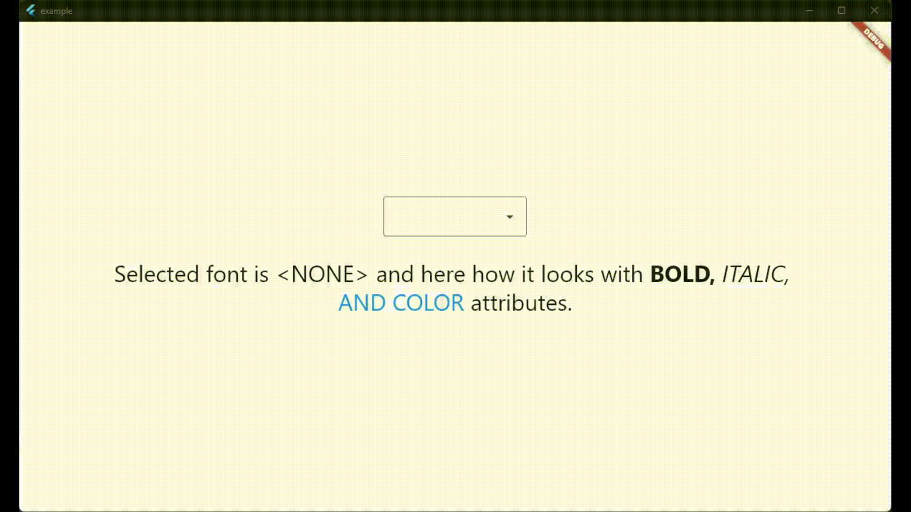

# system_fonts

A Flutter package that allows users to easily load system fonts on Windows, MacOS, and Linux platforms.

## Features

- Load system fonts dynamically in Flutter applications.
- Support for Windows, MacOS, and Linux platforms.
- Supports ttf and otf font formats.
- Simple API for loading and using system fonts in your Flutter project.

## Installation

1. Add the following line to your `pubspec.yaml` file in the `dependencies` section:

```yaml
dependencies:
    system_fonts: ^VERSION
```

## Usage

Font family names are the font file name in the system without extensions.
For example to change font family of Text widget to `arial`(arial.ttf), use `loadFont(String fontName)` method with parameter `arial`,
this function will load arial.ttf file in the system and return font family name.
```dart
class Example extends StatefulWidget {
  const Example({super.key});

  @override
  State<Example> createState() => _ExampleState();
}

class _ExampleState extends State<Example> {
  String fontFamily = '';

  @override
  void initState() {
    super.initState();
    SystemFonts().loadFont('arial').then((value) {
      setState(() {
        fontFamily = value.toString();
      });
    });
  }

  @override
  Widget build(BuildContext context) {
    return Text('this text will use arial font', style: TextStyle(fontFamily: fontFamily));
  }
}
```
You can load all the fonts on the system with `loadAllFonts()` method which returns all the available font family names 
and then you can use any font in any widget.

You can specify a font folder to load every font inside it and then use them in flutter with `addAdditionalFontDirectory(String path)` method.

You can add any font from full path with `loadFontFromPath(String path)` method.

You can list all available font family names to use with `getFontList()` method.

There is also a widget called `SystemFontSelector()` for list and select fonts and example app shows how to use it.



## License

This package is licensed under the MIT License. See the `LICENSE` file for details.
